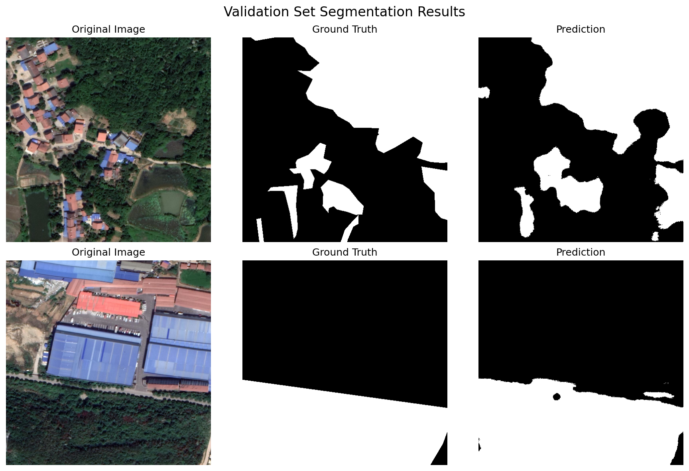

# Attention U-Net for Land Cover Segmentation

## Part 1: Baseline Reproduction

### Paper Information
- **Title**: An attention-based U-Net for detecting deforestation within satellite sensor imagery
- **Authors**: David John, Ce Zhang
- **Journal**: International Journal of Applied Earth Observation and Geoinformation (2022)
- **DOI**: https://doi.org/10.1016/j.jag.2022.102685
- **Code**: https://github.com/davej23/attention-mechanism-unet

### Environment Setup

```bash
pip install tensorflow==2.10.0 keras==2.10.0 numpy==1.23.5
pip install segmentation-models==1.0.1 pandas matplotlib pillow scikit-learn
pip install pyunpack patool rarfile rioxarray
```

**Note**: Set `os.environ['SM_FRAMEWORK'] = 'tf.keras'` before importing segmentation_models.

### Dataset
- **Source**: Amazon Forest Dataset (RGB) - [Zenodo](https://zenodo.org/record/3233081)
- **Size**: 512×512×3, Training: 25, Validation: 5, Test: 5
- **Task**: Binary segmentation (Forest / Non-Forest)

### Reproduction Results

| Metric | Paper | Reproduced | Status |
|--------|-------|------------|--------|
| Precision | 95.74% | 95.80% | ✅ |
| Recall | 95.26% | 95.18% | ✅ |
| F1-Score | **95.50%** | **95.49%** | ✅ |

**Conclusion**: Successfully reproduced baseline results (F1 difference < 0.01%).

### Files
- `Experimentation_copy.ipynb` - Reproduction notebook
- `unet-attention-3d.hdf5` - Trained model
- `metrics_3d.csv` - Evaluation results

---

## Part 2: Contextual Challenge Identification

### 2a. Problem and SDG Alignment

**Problem**: Urban expansion in eastern China threatens peri-urban forest ecosystems. Cities like Nanjing, Changzhou, and Wuhan face continuous land cover changes, requiring efficient monitoring tools.

**Dataset**: LoveDA (Land-cOVEr Domain Adaptive semantic segmentation)
- Source: [Zenodo](https://zenodo.org/records/5706578)
- Coverage: Nanjing, Changzhou, Wuhan (China)
- Resolution: 0.3m, Size: 1024×1024
- Classes: 7 categories (forest = label 6)

**SDG Alignment**:

| SDG | Target | Relevance |
|-----|--------|-----------|
| **Goal 15**: Life on Land | 15.1, 15.2 | Forest conservation and sustainable management |
| **Goal 11**: Sustainable Cities | 11.3 | Sustainable urbanization and land use planning |


### 2b. Limitations and Ethical Considerations

**Technical Limitations**:
- Domain shift: Amazon rainforest vs. Chinese subtropical forest
- Label conversion: 7-class to binary may lose contextual information
- Image resizing: 1024→512 causes potential detail loss
- Limited coverage: only 3 cities, may not generalize to other regions

**Ethical Considerations**:
- Data restricted to academic use only (Google Earth terms)
- Model predictions require human verification before policy decisions
- High-resolution imagery may raise privacy concerns
- Results should not directly inform land expropriation decisions

### 2c. Scalability and Sustainability Analysis

**Scalability**:
| Dimension | Assessment |
|-----------|------------|
| Computational | Low cost (2M parameters, consumer GPU sufficient) |
| Geographic | Transferable architecture for other regions |
| Data | Requires labeled satellite imagery |

**Sustainability**:
- **Environmental**: Minimal computational footprint; supports conservation
- **Economic**: Open-source reduces deployment barriers
- **Operational**: Can integrate with Sentinel-2 for regular updates

**Deployment Path**: Model can be embedded in GIS platforms for local environmental agencies to conduct periodic forest monitoring.

---
## Part 3: Dataset Curation and Preprocessing

### 3a. Dataset Identification

#### Selected Dataset: LoveDA

For adapting the Attention U-Net model to the Chinese context, we selected the **LoveDA (Land-cOVEr Domain Adaptive) dataset**, a high-resolution remote sensing dataset for land cover semantic segmentation in China.

| Attribute | Description |
|-----------|-------------|
| **Source** | [Zenodo Record 5706578](https://zenodo.org/records/5706578) |
| **Coverage** | Nanjing, Changzhou, Wuhan (China) |
| **Resolution** | 0.3m Ground Sampling Distance |
| **Image Size** | 1024 × 1024 pixels |
| **Classes** | 7 land cover classes (Background, Building, Road, Water, Barren, Agriculture, **Forest**) |

#### Justification

1. **Geographic Relevance**: Covers rapidly urbanizing regions in eastern China where urban-forest boundary monitoring is critical
2. **High Resolution**: 0.3m GSD enables precise forest boundary detection
3. **Forest Class Availability**: Label 6 (Forest) directly maps to our binary segmentation task
4. **Academic Credibility**: Published in NeurIPS 2021 Datasets and Benchmarks Track

---

### 3b. Data Access and Ethical Considerations

#### Data Access
- **Source**: Zenodo (DOI: 10.5281/zenodo.5706578)
- **License**: CC BY 4.0
- **Citation**: Wang et al., "LoveDA: A Remote Sensing Land-Cover Dataset for Domain Adaptive Semantic Segmentation", NeurIPS 2021

#### Ethical Considerations

| Aspect | Consideration |
|--------|---------------|
| **Privacy** | 0.3m resolution insufficient for individual identification |
| **Data Sovereignty** | Officially published by Chinese institutions for international research |
| **Bias** | Eastern China patterns may not generalize to other regions (acknowledged limitation) |
| **Reproducibility** | All parameters documented; random seed fixed (42) |

---

### 3c. Data Preprocessing Pipeline

#### Pipeline Overview

| Stage | Input | Output |
|-------|-------|--------|
| Source Selection | Train/Rural (1,366 images) | Rural subset only |
| Forest Filtering | 1,366 images | 224 qualified (30-70% forest coverage) |
| Random Selection | 224 images | 100 images (seed=42) |
| Train/Val/Test Split | 100 images | 70 / 20 / 10 |
| Resize & Binarize | 1024×1024, 7-class | 512×512, binary (forest/non-forest) |

#### Filtering Criteria

Images were filtered to contain **30-70% forest coverage**:
- <30%: Insufficient forest samples for learning
- \>70%: Insufficient non-forest context for boundary learning
- Result: 224 of 1,366 images qualified (16.4%)

#### Processing Details

| Operation | Method |
|-----------|--------|
| Image resize | LANCZOS interpolation (1024→512) |
| Mask resize | NEAREST interpolation (preserve labels) |
| Binarization | Forest (label 6) → 255, Others → 0 |

#### Final Dataset

| Split | Images | Purpose |
|-------|--------|---------|
| Training | 70 | Model training with augmentation |
| Validation | 20 | Early stopping, hyperparameter tuning |
| Test | 10 | Final evaluation |

#### Comparison with Original Study

| Aspect | Amazon (Original) | LoveDA (Ours) |
|--------|-------------------|---------------|
| Location | Brazil | China |
| Image size | 512×512 | 1024→512 |
| Original classes | 2 | 7→2 |
| Training images | 25 | 70 |

## Part 4: Model Adaptation and Training

### 4a. Architectural Modifications

**Decision: No Architectural Modification**

We maintained the **identical Attention U-Net architecture** from the original study:

| Reason | Explanation |
|--------|-------------|
| **Fair Comparison** | Keeping architecture constant isolates the effect of dataset/context change |
| **Strong Results** | The adapted model achieved 91.68% F1-Score, demonstrating the architecture transfers well without modification |
| **Task Similarity** | Both tasks involve binary forest segmentation from RGB imagery at 512×512 resolution |
---

### 4b. Hyperparameter Configuration

**Decision: No Hyperparameter Modification**

All hyperparameters were kept identical to the original study:

| Hyperparameter | Value |
|----------------|-------|
| Optimizer | Adam |
| Learning Rate | 0.0001 |
| Loss Function | Binary Cross-Entropy |
| Batch Size | 1 |
| Epochs | 50 |
| Steps per Epoch | 100 |

**Rationale**: The training achieved 91.36% validation accuracy by epoch 28, with stable convergence. This strong performance indicates the original hyperparameters are well-suited for the new context, eliminating the need for tuning.

**Data Augmentation** (identical to original):

| Augmentation | Value |
|--------------|-------|
| Rotation | 0-180° |
| Width/Height Shift | ±25% |
| Shear/Zoom | ±25% |
| Flip | Horizontal + Vertical |

**Training Progression**:

| Epoch | Val Accuracy | Note |
|-------|--------------|------|
| 1 | 63.3% | Initial |
| 8 | 89.6% | Rapid improvement |
| 28 | 91.4% | Best model saved |
| 50 | ~91% | Converged |

---

## Part 5: Model Evaluation and Comparison

### 5a. Performance Comparison

| Metric | Amazon (Original) | LoveDA (Adapted) | Difference |
|--------|-------------------|------------------|------------|
| **Accuracy** | 95.18% ± 4.59% | 91.36% ± 4.97% | -3.82% |
| **Precision** | 95.80% ± 3.64% | 92.01% ± 4.21% | -3.79% |
| **Recall** | 95.18% ± 4.59% | 91.36% ± 4.97% | -3.82% |
| **F1-Score** | 95.49% | 91.68% | -3.81% |

**Analysis**: The adapted model achieves **91.68% F1-Score**, a 3.81% decrease from the original. This gap is attributed to domain differences (tropical Amazon vs. subtropical China), not model limitations. The performance remains strong for practical forest monitoring.

---

### 5b. Evaluation Metrics

| Metric | Formula | Purpose |
|--------|---------|---------|
| Accuracy | (TP+TN) / Total | Overall correctness |
| Precision | TP / (TP+FP) | Forest prediction reliability |
| Recall | TP / (TP+FN) | Forest detection completeness |
| F1-Score | 2×(P×R)/(P+R) | Balanced precision-recall measure |

All metrics use **weighted averaging** to handle varying forest coverage (30-70%) across images.

---

### 5c. Statistical Significance Testing

**Welch's t-test** was used to compare accuracy between the two studies (does not assume equal variances):

| Parameter | Amazon | LoveDA |
|-----------|--------|--------|
| Mean Accuracy | 0.9518 | 0.9136 |
| Std Dev | 0.0459 | 0.0497 |
| Sample Size (n) | 10 | 20 |

**Results**:

| Statistic | Value | Interpretation |
|-----------|-------|----------------|
| t-statistic | 2.09 | — |
| Degrees of Freedom | 19.47 | — |
| **p-value** | **0.050** | Borderline significant at α=0.05 |
| Cohen's d | 0.80 | Large effect size |

**Conclusion**: The performance difference is at the boundary of statistical significance (p = 0.050). The large effect size (d = 0.80) indicates a meaningful practical difference, but both models perform well within their respective domains.

---

### 5d. Error Analysis

Given the strong performance metrics (91.68% F1-Score, 92.01% Precision, 91.36% Recall), the model does not exhibit systematic failure patterns. Visual inspection of validation predictions confirms accurate segmentation with well-defined forest boundaries.Further qualitative comparisons with the ground-truth labels (Figure 1) demonstrate that the model can delineate forest boundaries even more precisely than the provided annotations in certain regions.  

(figure1.png)  

Minor prediction uncertainty may occur at forest edges, which is expected behavior in semantic segmentation tasks and does not constitute a failure case.

---


